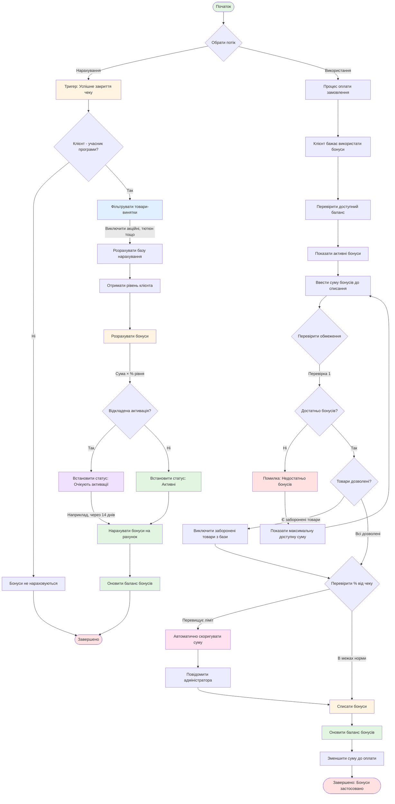

# UC-FR6.1.6: Управління бонусною системою

## Mermaid діаграма

## Опис процесу

Повний цикл управління бонусною програмою лояльності, що включає автоматичне нарахування бонусів за покупки та їх використання для оплати з урахуванням обмежень та правил програми.

## Основні потоки

### 1. Автоматичне нарахування бонусів (UC-FR6.1.6.1)
- Перевірка участі клієнта в програмі
- Фільтрація товарів-винятків
- Розрахунок бонусів за рівнем клієнта
- Нарахування з відкладеною активацією (опціонально)

### 2. Використання бонусів для оплати (UC-FR6.1.6.2)
- Перевірка балансу активних бонусів
- Валідація обмежень (товари, % від чеку)
- Автоматичне коригування суми при порушеннях
- Списання бонусів та зменшення суми до оплати

## Результат

Бонуси нараховані/списані. Баланс бонусів оновлено. Сума до оплати зменшена (при використанні).
