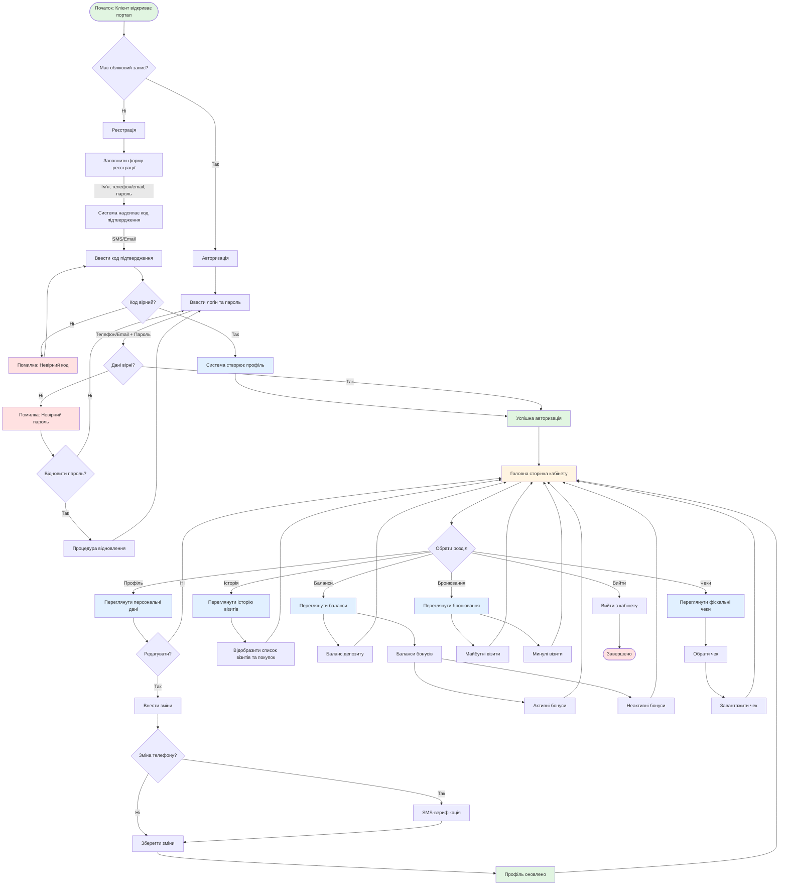

# UC-FR6.1.10: Онлайн-особистий кабінет клієнта

## Mermaid діаграма

## Опис процесу

Онлайн-особистий кабінет надає клієнтам самостійний доступ до їх профілю, історії візитів, балансів депозиту та бонусів, бронювань та фіскальних чеків через веб-сайт або мобільний додаток.

## Основні функції

### Реєстрація та авторизація
- Реєстрація з верифікацією через SMS/Email
- Авторизація за логіном та паролем
- Відновлення пароля

### Розділи кабінету

1. **Профіль** - Перегляд та редагування персональних даних
2. **Історія** - Перегляд історії візитів та покупок
3. **Баланси** - Перевірка депозиту та бонусів
4. **Бронювання** - Перегляд майбутніх та минулих візитів
5. **Чеки** - Перегляд та завантаження фіскальних чеків

## Результат

Клієнт отримав доступ до інформації. Профіль оновлено (у разі редагування).
