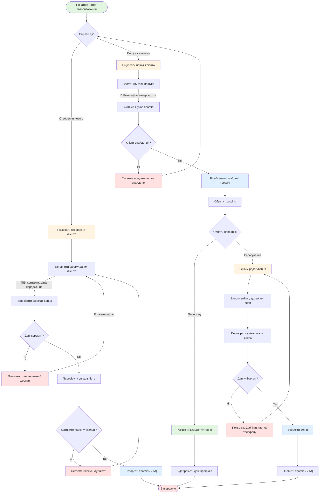

# UC-FR6.1.1: Управління профілем клієнта

## Mermaid діаграма

## Опис процесу

Управління профілями клієнтів, що включає створення нових профілів, пошук існуючих, перегляд та редагування даних клієнтів з перевіркою унікальності та валідацією даних.

## Основні операції

1. **Створення нового клієнта** - Заповнення форми з персональними даними та валідацією
2. **Пошук клієнта** - Швидкий пошук за ПІБ, номером телефону або картки
3. **Перегляд профілю** - Відображення даних у режимі "тільки для читання"
4. **Редагування профілю** - Внесення змін з перевіркою унікальності

## Результат

Профіль клієнта успішно створено або оновлено в системі з дотриманням унікальності та коректності даних.
