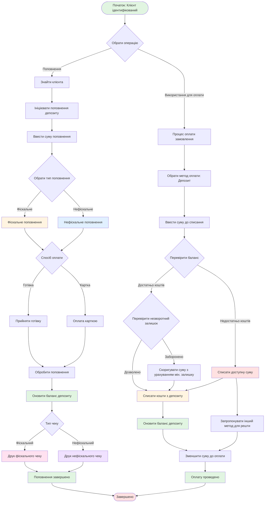

# UC-FR6.1.5: Управління депозитним рахунком клієнта

## Mermaid діаграма

## Опис процесу

Управління депозитним рахунком клієнта, що включає поповнення депозиту (фіскальне/нефіскальне) та використання коштів для оплати послуг і товарів з урахуванням незворотного залишку.

## Основні операції

### 1. Поповнення депозиту
- Вибір типу поповнення (фіскальне/нефіскальне)
- Прийняття оплати (готівка/картка)
- Оновлення балансу
- Друк відповідного чеку

### 2. Використання депозиту для оплати
- Вибір депозиту як методу оплати
- Перевірка балансу та незворотного залишку
- Списання коштів
- Зменшення суми до оплати

## Результат

Баланс депозитного рахунку оновлено. Оплату проведено. Чек надруковано (при поповненні).
