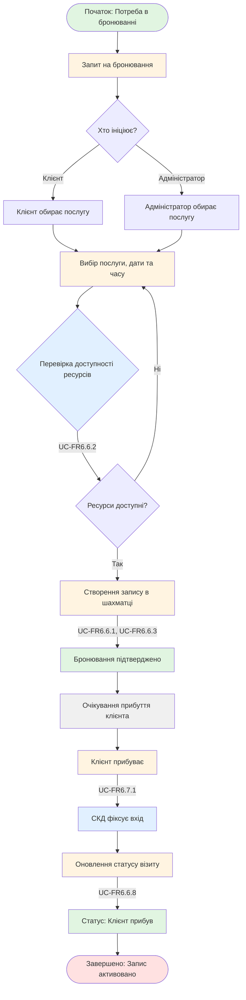

# WP-FR6.9.2: Робочий процес планування записів

## Mermaid діаграма

## Опис процесу

Процес створення та управління попереднім записом клієнта на послуги оздоровчого комплексу. Включає бронювання, перевірку доступності ресурсів та автоматичне оновлення статусу при прибутті клієнта.

## Основні кроки

1. **Запит на бронювання** - Клієнт або Адміністратор ініціює процес бронювання
2. **Вибір послуги та часу** - Визначення бажаної послуги, дати та часу відвідування
3. **Перевірка доступності** - Система перевіряє наявність вільних ресурсів
4. **Створення запису** - Система створює бронювання в "шахматці"
5. **Прибуття клієнта** - СКД (Система Контролю Доступу) фіксує вхід
6. **Оновлення статусу** - Статус візиту змінюється на "Клієнт прибув"

## Результат

Бронювання створено, відображено в системі, статус візиту автоматично оновлюється при прибутті клієнта.
