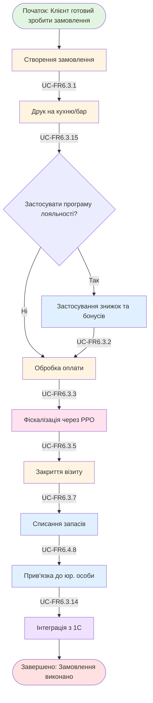

# WP-FR6.9.1: Робочий процес виконання замовлення

## Mermaid діаграма

## Опис процесу

Повний наскрізний процес обробки замовлення клієнта від створення до закриття візиту та інтеграції з 1С.

## Основні кроки

1. **Створення замовлення** - Адміністратор рецепції створює замовлення в POS
2. **Друк на кухню/бар** - Система надсилає замовлення на принтери
3. **Застосування лояльності** - Система/Адміністратор застосовує знижки та бонуси
4. **Оплата** - Обробка платежу різними методами
5. **Фіскалізація** - Друк фіскального чека через РРО
6. **Закриття візиту** - Система закриває візит
7. **Списання запасів** - Автоматичне списання використаних запасів
8. **Прив'язка до юр. особи** - Транзакція прив'язується до правильної юр. особи
9. **Інтеграція з 1С** - Передача даних в 1С

## Результат

Замовлення повністю виконано, оплачено, фіскалізовано; запаси списані.
