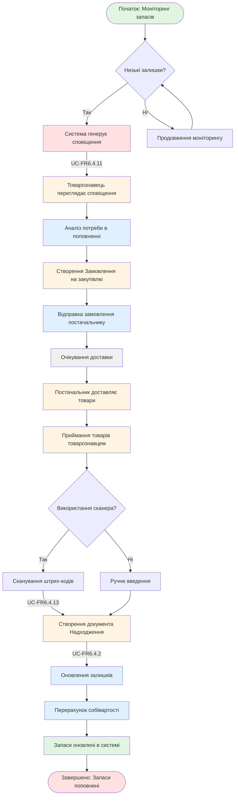

# WP-FR6.9.3: Робочий процес поповнення запасів

## Mermaid діаграма

## Опис процесу

Повний цикл поповнення запасів від автоматичного виявлення низьких залишків до оприбуткування товару та оновлення собівартості в системі.

## Основні кроки

1. **Виявлення потреби** - Система автоматично генерує сповіщення про низькі залишки
2. **Створення замовлення** - Товарознавець створює Замовлення на закупівлю постачальнику
3. **Доставка** - Постачальник доставляє товари
4. **Приймання** - Товарознавець приймає товари, можливо зі сканером
5. **Створення Надходження** - Оформлення документа надходження товарів
6. **Оновлення системи** - Автоматичне оновлення залишків та перерахунок собівартості

## Результат

Запаси поповнені, залишки та собівартість оновлені в системі.
