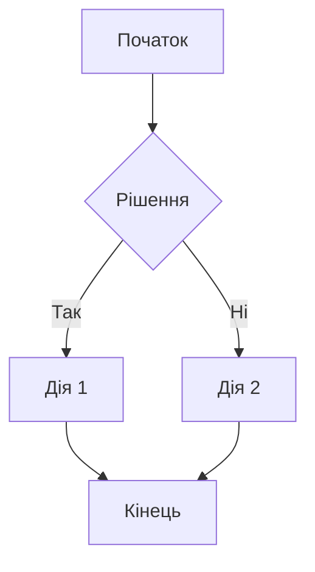

# Workflows

Цей каталог містить діаграми робочих процесів для проєкту впровадження Odoo в компанії Termi.

## Типи діаграм

### Flowcharts (Блок-схеми)
Діаграми для візуалізації послідовності кроків у бізнес-процесах.

### Sequence Diagrams (Діаграми послідовності)
Діаграми для відображення взаємодії між різними компонентами системи.

### State Diagrams (Діаграми станів)
Діаграми для відображення різних станів об'єктів у системі.

### Entity Relationship Diagrams (ER-діаграми)
Діаграми для візуалізації структури даних та зв'язків між сутностями.

## Формат

Всі діаграми створюються за допомогою [Mermaid](https://mermaid.js.org/) - інструменту для створення діаграм з текстового опису.

## Приклад

## Організація файлів

Діаграми організовані за модулями Odoo:
- `sales/` - Процеси продажів
- `purchase/` - Процеси закупівель
- `inventory/` - Складські процеси
- `accounting/` - Фінансові процеси
- `hr/` - HR процеси

---

**Дата створення**: 2025-12-11
